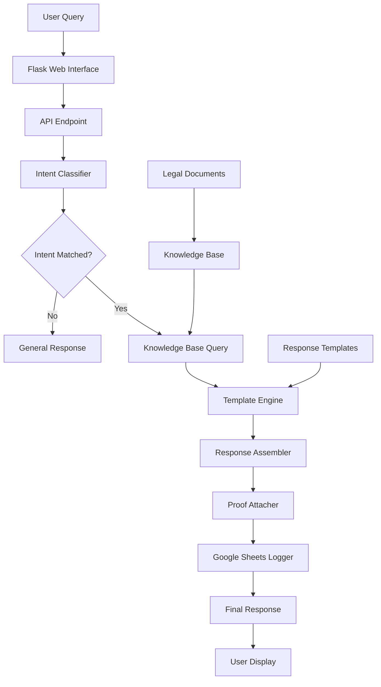

# PC-MLRA  
## Proof-Carrying Medical Legal Rights Advisor


A **deterministic, zero-hallucination** system for **medical rights awareness** that provides **proof-carrying responses** with exact legal citations from official Indian government documents.

> **⚠️ Important**: This system is designed for **academic evaluation, demonstrations, and awareness**, not legal advice. Always consult a qualified legal professional for legal matters.

---

## 🎯 Why PC-MLRA is Different

| Feature | Traditional AI Chatbots | PC-MLRA |
|---------|-----------------------|---------|
| **Accuracy** | May hallucinate or invent facts | **Zero hallucination** - only cites actual laws |
| **Proof** | Often cannot cite sources | **Every response includes legal citations** |
| **Determinism** | Same input → different outputs | **Same input → same output, every time** |
| **Transparency** | Black box decisions | **Full traceability** of legal sources |
| **Legal Basis** | General knowledge | **Based on specific laws**: NHRC Charter & IMC Regulations |

---

## 📚 Legal Foundation

PC-MLRA is built exclusively on two official Indian government documents:

### 1. **Charter of Patient Rights (2019)**
- **Source**: National Human Rights Commission (NHRC)
- **Purpose**: Defines 17 fundamental rights of patients in healthcare settings
- **Coverage**: Right to information, consent, privacy, emergency care, etc.
- **Availability**: Public domain, freely downloadable from [nhrc.nic.in](https://nhrc.nic.in/)

### 2. **IMC Ethics Regulations (2002)**
- **Source**: Medical Council of India (now National Medical Commission)
- **Purpose**: Establishes ethical obligations of medical practitioners
- **Coverage**: Doctor-patient relationship, confidentiality, professional conduct
- **Availability**: Public domain, freely available from [nmc.org.in](https://www.nmc.org.in/)

---

## ✨ Key Features

### ✅ **Zero Hallucination Guarantee**
- Fully template-based response system
- No generative AI or LLM components
- Every response is pre-validated against legal sources

### ✅ **Proof-Carrying Responses**
- Every answer includes exact legal clauses
- Citations with document name, section, and clause numbers
- Direct quotes from source documents

### ✅ **Deterministic Behavior**
- Same question → identical answer every time
- Predictable, testable, and verifiable
- Essential for legal/medical applications

### ✅ **Bidirectional Coverage**
- **Patient Rights**: What patients are entitled to
- **Doctor Obligations**: What doctors must provide
- Complete ecosystem view of medical ethics

### ✅ **Dual Interface**
- **Web Application**: Modern Flask-based UI with chat interface
- **Console Application**: CLI for testing, debugging, and integration

### ✅ **Usage Analytics**
- Google Sheets integration for query logging
- Session tracking and analytics
- Real-time monitoring of system usage

---

## 📊 System Statistics

| Metric | Count | Description |
|--------|-------|-------------|
| **Legal Clauses** | 77 | Individual legal provisions extracted |
| **Rights & Obligations** | 46 | Distinct patient rights and doctor duties |
| **Response Templates** | 28 | Pre-built response patterns |
| **Medical Intents** | 20+ | Recognizable question types |
| **Source Documents** | 2 | NHRC Charter + IMC Regulations |
| **Knowledge Base Entries** | 77 | Structured legal knowledge units |

---

## 🚀 Quick Start Guide

### Prerequisites
- Python 3.8 or higher
- pip (Python package manager)
- Google account (for Google Sheets logging - optional)

### Step 1: Clone the Repository
```bash
git clone https://github.com/yourusername/pc-mlra.git
cd pc-mlra
```

### Step 2: Set Up Virtual Environment
```bash
# Create virtual environment
python -m venv venv

# Activate it
# On macOS/Linux:
source venv/bin/activate
# On Windows:
venv\Scripts\activate
```

### Step 3: Install Dependencies
```bash
pip install -r requirements.txt
```

### Step 4: Configure Google Sheets (Optional)
```bash
# Copy the template config
cp config/google_sheets_config_template.py config/google_sheets_config.py

# Edit the file with your Google Sheets credentials
# Follow instructions in the template file
```

### Step 5: Run the Web Application
```bash
python run.py
```

### Step 6: Access the Application
Open your browser and navigate to:
```
http://localhost:5000
```

---

## 🏗️ Architecture Overview



## 📁 Project Structure

```
pc-mlra/
├── app/                              # Flask application
│   ├── __init__.py                   # App initialization
│   ├── routes/                       # URL routing
│   │   ├── api.py                    # REST API endpoints
│   │   └── web.py                    # Web page routes
│   ├── services/                     # Business logic
│   │   ├── pc_mlra_service.py        # Core MLRA service
│   │   ├── google_sheets_service.py  # Logging service
│   │   └── demo_service.py           # Demonstration service
│   ├── utils/                        # Utilities
│   │   ├── google_sheets_logger.py   # Sheets logging
│   │   ├── formatters.py             # Response formatting
│   │   └── simple_sheets_logger.py   # Backup logger
│   └── templates/                    # HTML templates
│       ├── index.html                # Home page
│       └── chat.html                 # Chat interface
├── src/                              # Core PC-MLRA engine
│   ├── intent_classifier.py          # Rule-based intent detection
│   ├── knowledge_loader.py           # Loads legal knowledge base
│   ├── response_assembler.py     # Builds proof-carrying responses
│   ├── template_engine.py     # Template-based response generation
│   └── main.py                 #    Console application entry
├── config/                           # Configuration files
│   ├── environments.py               # Environment settings
│   ├── google_sheets_config.py       # Google Sheets config
│   └── deployment/                   # Deployment configurations
├── data/                             # Legal knowledge base
│   ├── raw_documents/                # Original PDF documents
│   ├── structured/                   # Processed JSON knowledge
│   └── templates/                    # Response templates
├── tests/                            # Test suite
│   ├── unit/                         # Unit tests
│   └── integration/                  # Integration tests
├── requirements.txt                  # Python dependencies
├── run.py                            # Application runner
├── setup.py                          # Package setup
└── README.md                         # This file
```

---

## 🖥️ Console Application

PC-MLRA includes a powerful console interface for testing and development:

```bash
# Run the console interface
python src/main.py
```

### Console Commands

| Command | Description | Example |
|---------|-------------|---------|
| `help` | Show available commands | `help` |
| `stats` | Display system statistics | `stats` |
| `list rights` | List all patient rights | `list rights` |
| `list obligations` | List all doctor obligations | `list obligations` |
| `search <term>` | Search knowledge base | `search consent` |
| `query <question>` | Ask a question | `query "Can I get my medical records?"` |
| `exit` | Exit the application | `exit` |

### Example Console Session
```text
PC-MLRA Console v1.0.0
Type 'help' for commands, 'exit' to quit

> stats
System Statistics:
- Legal Clauses: 77
- Patient Rights: 17
- Doctor Obligations: 29
- Response Templates: 28

> query "What is informed consent?"
RESPONSE: Informed consent means...
PROOF: [NHRC Charter, Section 3.2, Clause 5]

> search emergency
Found 3 clauses related to 'emergency':
1. Right to emergency medical care (NHRC 4.1)
2. Doctor's duty in emergencies (IMC 2.7)
3. ...
```

---

## 🌐 Web Interface Features

### Home Page (`/`)
- System statistics and overview
- Quick access to chat interface
- Information about legal sources

### Chat Interface (`/chat`)
- **Real-time conversation**: Interactive Q&A interface
- **Proof toggle**: Show/hide legal citations
- **Session management**: Persistent chat history
- **Example questions**: Clickable sample queries
- **Responsive design**: Works on mobile and desktop

### API Endpoints

| Endpoint | Method | Description | Example Response |
|----------|--------|-------------|------------------|
| `/api/query` | POST | Process medical queries | `{"response": "...", "proof": "...", "intent": "..."}` |
| `/api/health` | GET | System health check | `{"status": "healthy", "version": "1.0.0"}` |
| `/api/system/stats` | GET | System statistics | `{"clauses": 77, "rights": 17, ...}` |
| `/api/examples` | GET | Example questions | `["What are my rights?", "What is consent?"]` |
| `/api/debug/sheets-status` | GET | Google Sheets status | `{"status": "connected", "rows": 150}` |

### Example API Usage
```bash
# Query the system via API
curl -X POST http://localhost:5000/api/query \
  -H "Content-Type: application/json" \
  -d '{"query": "What are my rights to medical records?"}'

# Response
{
  "status": "success",
  "response": "You have the right to access your medical records...",
  "proof": "NHRC Patient Charter (2019), Section 3.1, Right to Information",
  "intent": "right_to_records",
  "session_id": "abc123-xyz456"
}
```

---

## 💬 Example Queries

Try these in the web or console interface:

### Patient Rights Questions
- "What are my rights as a patient?"
- "Can I get a copy of my medical records?"
- "What is informed consent?"
- "Do I have a right to privacy?"
- "What should happen in emergency treatment?"
- "Can I choose my own doctor?"
- "What if I want a second opinion?"
- "Are my medical details confidential?"

### Doctor Obligations Questions
- "What are doctors required to tell patients?"
- "What ethical rules do doctors follow?"
- "Can doctors refuse emergency treatment?"
- "What confidentiality duties do doctors have?"
- "How should doctors handle patient complaints?"

### System Commands
- "Show me statistics"
- "What can you help me with?"
- "List all patient rights"
- "Search for privacy rights"

---

## ⚙️ Configuration

### Environment Variables
Create a `.env` file in the root directory:

```env
# Flask Configuration
FLASK_ENV=development
FLASK_DEBUG=True
SECRET_KEY=your-secret-key-here

# Google Sheets Configuration (Optional)
GOOGLE_SHEETS_CREDENTIALS_PATH=config/secrets/google_sheets_credentials.json
GOOGLE_SHEETS_ID=your-google-sheet-id
```

### Google Sheets Setup (Optional)
1. Enable Google Sheets API in Google Cloud Console
2. Create service account credentials
3. Share your Google Sheet with the service account email
4. Copy credentials to `config/secrets/google_sheets_credentials.json`

---

## 🧪 Testing

### Running Tests
```bash
# Run all tests
python -m pytest tests/

# Run specific test categories
python -m pytest tests/unit/          # Unit tests
python -m pytest tests/integration/   # Integration tests

# Run with coverage report
python -m pytest --cov=app --cov=src tests/
```

### Test Examples
```python
# Example test for intent classification
def test_intent_classification():
    classifier = IntentClassifier()
    intent = classifier.classify("Can I get my medical reports?")
    assert intent == "right_to_records"
    
# Example test for proof generation
def test_proof_generation():
    response = generate_response("right_to_information")
    assert "[NHRC" in response["proof"]  # Should contain citation
```

---

## 🔧 Deployment

### Local Production Deployment
```bash
# Install production dependencies
pip install gunicorn

# Run with Gunicorn (recommended for production)
gunicorn -w 4 -b 0.0.0.0:5000 "app:create_app()"

# Or with waitress (Windows compatible)
pip install waitress
waitress-serve --port=5000 "app:create_app"
```

### Cloud Deployment Options

#### 1. **Render.com** (Free Tier Available)
```yaml
# render.yaml
services:
  - type: web
    name: pc-mlra
    env: python
    buildCommand: pip install -r requirements.txt
    startCommand: gunicorn -w 4 -b 0.0.0.0:$PORT "app:create_app()"
```

#### 2. **Railway.app**
- Push to GitHub, connect Railway
- Automatic deployment on push
- Free tier includes database and logs

#### 3. **PythonAnywhere**
- Upload files via web interface
- Schedule tasks for knowledge base updates
- Free tier available

#### 4. **Heroku**
```procfile
# Procfile
web: gunicorn -w 4 -b 0.0.0.0:$PORT "app:create_app()"
```

### Docker Deployment
```dockerfile
# Dockerfile
FROM python:3.9-slim
WORKDIR /app
COPY requirements.txt .
RUN pip install --no-cache-dir -r requirements.txt
COPY . .
CMD ["gunicorn", "-w", "4", "-b", "0.0.0.0:5000", "app:create_app()"]
```

```bash
# Build and run
docker build -t pc-mlra .
docker run -p 5000:5000 pc-mlra
```

---

## 📊 Google Sheets Logging

PC-MLRA includes advanced logging to Google Sheets:

### What Gets Logged
- **Timestamp**: When query was made
- **Query Text**: Exact user question
- **Response**: System response
- **Intent**: Detected intent category
- **IP Address**: User IP (anonymized)
- **Session ID**: Unique session identifier

### Accessing Logs
1. Open your configured Google Sheet
2. View real-time queries
3. Analyze question patterns
4. Monitor system usage

### Disabling Logging
Comment out Google Sheets calls in `app/routes/api.py` if not needed.

---

## 🔍 Understanding the Knowledge Base

The system uses a structured JSON knowledge base:

```json
{
  "clause_id": "NHRC_3.1",
  "document": "NHRC Patient Charter",
  "section": "3. Right to Information",
  "clause_number": "3.1",
  "content": "Every patient has the right to know...",
  "intents": ["right_to_information", "general_query"],
  "tags": ["information", "transparency", "records"],
  "proof_format": "NHRC Patient Charter (2019), Section 3.1"
}
```

### Knowledge Base Creation Process
1. **PDF Extraction**: Convert PDFs to text
2. **Clause Identification**: Break into individual legal clauses
3. **Metadata Tagging**: Add intent categories and tags
4. **Template Creation**: Build response templates
5. **Validation**: Verify against original documents

---

## 🤝 Contributing

We welcome contributions! Here's how:

### 1. Fork and Clone
```bash
git clone https://github.com/your-username/pc-mlra.git
cd pc-mlra
```

### 2. Create a Feature Branch
```bash
git checkout -b feature/amazing-feature
```

### 3. Make Your Changes
- Follow existing code style
- Add tests for new features
- Update documentation

### 4. Test Your Changes
```bash
python -m pytest tests/
python run.py  # Verify it works
```

### 5. Submit a Pull Request
- Describe your changes
- Reference any related issues
- Ensure all tests pass

### Contribution Areas
- **New Legal Sources**: Add more government documents
- **Improved Intent Detection**: Better question matching
- **UI Enhancements**: Better web interface
- **Internationalization**: Support for multiple languages
- **Additional Features**: Voice interface, mobile app, etc.

---

## 📝 License

This project is licensed under the MIT License - see the [LICENSE](LICENSE) file for details.

### Third-Party Components
- Flask (BSD License)
- Google API Client (Apache 2.0)
- Various Python utilities (MIT/BSD)

---

## ⚖️ Legal Disclaimer (IMPORTANT)

### Intended Use
PC-MLRA is designed for:
- Educational purposes
- Raising awareness about patient rights
- Academic research and evaluation
- Demonstrations of deterministic AI systems

### NOT Intended For
- Legal advice or counsel
- Medical diagnosis or treatment decisions
- Replacement for professional legal consultation
- Making healthcare decisions

### Accuracy Statement
While we strive for accuracy:
1. Laws may change or be interpreted differently
2. Local regulations may override national guidelines
3. Legal advice requires professional judgment
4. This system simplifies complex legal concepts

**Always consult a qualified legal professional for legal matters.**

---

## 🌟 Acknowledgments

- **National Human Rights Commission (NHRC)**: For the Patient Charter
- **National Medical Commission (NMC)**: For ethical regulations
- **Open Source Community**: For invaluable tools and libraries
- **Contributors**: Everyone who helped build and improve PC-MLRA

---

## 📈 Roadmap

### Phase 1: Complete ✓
- Core knowledge base from NHRC & IMC
- Basic web interface
- Console application
- Zero-hallucination proof system

### Phase 2: In Progress
- Additional legal sources
- Multi-language support
- Advanced analytics dashboard
- API documentation

### Phase 3: Planned
- Mobile application
- Voice interface
- Integration with hospital systems
- Expanded international coverage

---

## 🏆 Why Choose PC-MLRA?

1. **Trustworthy**: Every claim is legally verifiable
2. **Transparent**: Full source citations provided
3. **Deterministic**: Predictable, consistent behavior
4. **Educational**: Raises awareness about medical rights
5. **Open Source**: Fully inspectable, modifiable, extendable

---

## 🚨 Emergency Note

If you are experiencing a medical emergency:
1. **Call emergency services immediately** (108 in India)
2. **Go to the nearest hospital**
3. **Do not rely on any software** for emergency decisions

This system is for **awareness and education only**, not emergency guidance.

---

**Built with ❤️ for Medical Rights Awareness**  
**Zero Hallucination. Fully Deterministic. Proof-Carrying by Design.**

---
*Last Updated: January 2026*  
*Version: 1.0.0*  
*Author: Naman Kumar Sharma*  
*License: MIT*